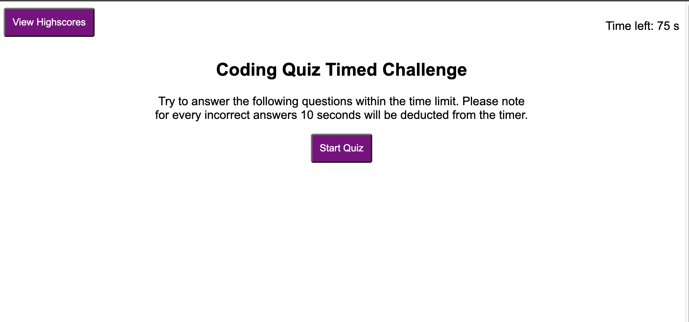
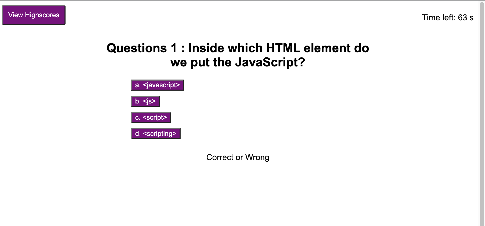
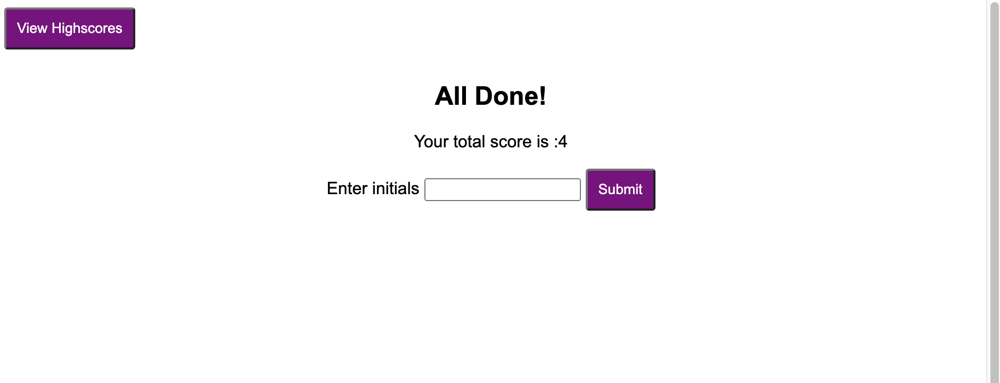

# code_quiz
The published website can be found [here](https://jgporter24.github.io./code_quiz/)

## Description
This website is designed to test ones javascript knoweldge in a window of time. You will find eight questions with multiple choice answers. Be carful with every wrong answer 10 seconds will be deducted from the timer. Each answer is selected upon a click and a prompt below will show an "Awesome!" if you are correct or "Oops!" if you are wrong. If the times run out you will be prompted with your total score and to enter your initials for the Highscores scoreboard. If you finish the whole test you will also be asked to enter your initals with your score. Once submitted you will be broght to the Highscores page which will show you the list of highest scores. 

You will find the use of the following:
- HTML
- CSS
- JavaScript

## Examples

Below are snippets of what the quiz looks like before clicking the start button, a sample of a question page, a sample of time expired page, a sample of completeing the test and a sample of the highscores page. 

## Usage
The elements of this site express and show the functionality of how you can use HTML, CSS, and JavaScript to create an interactive and designed website. It does this by also giving the user an experience to test their knowledge. 

## Thank You

Huge thanks to classmates, office hours and tutors for making this site possible, js can be tedious for but taking time and talking through it helps build a complete picture. 